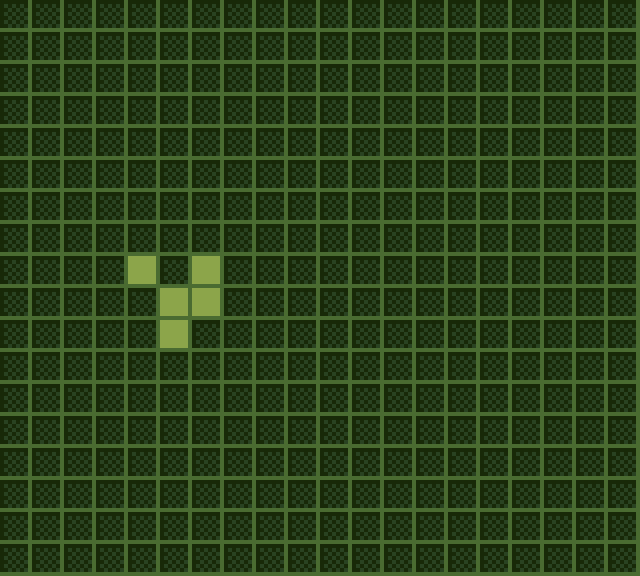
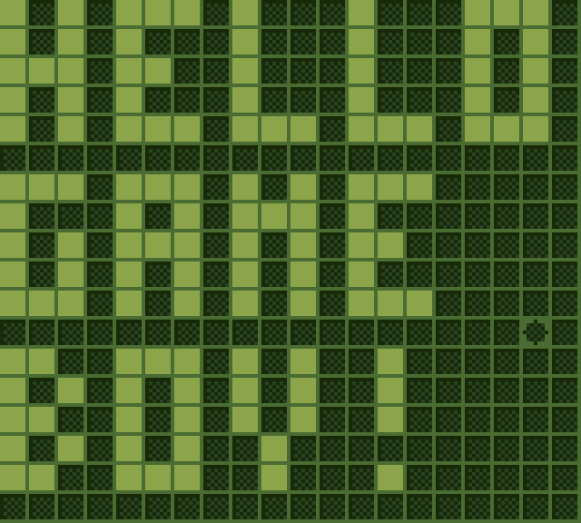
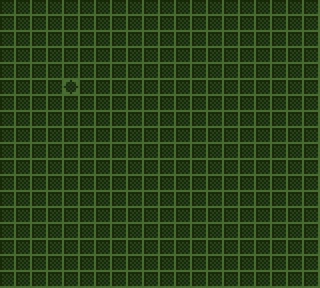

# About

**Game of Life GB** est un portage du [Jeu de la vie de Conway](https://conwaylife.com/) pour la GameBoy en utilisant le [GBDK](https://github.com/gbdk-2020/gbdk-2020), et le [hUGEDriver](https://github.com/SuperDisk/hUGEDriver) pour la musique.

Ce jeu donne un cadrillage recursive de cellules de taille 20x18 avec la possiblité de mettre en pause quand on veut, et effacer le cadrillage ou le rendre aléatoire.


  
  
  
  
  


## Itch.io

<iframe frameborder="0" src="https://itch.io/embed/3245115?border_width=5&amp;bg_color=284020&amp;fg_color=88a048&amp;link_color=445434&amp;border_color=486830" width="560" height="175"><a href="https://killarexe.itch.io/game-of-life-gb">Game of Life GB by Killar.exe</a></iframe>

## Controls

A - Mettre / Enlever une cellule du cadrillage

B - Effacer le cadrillage

Select - Rendre aléatoire le cadrillage

Directional Pad - Bouge le curseur quand la simulation est en pause.

## Repo


