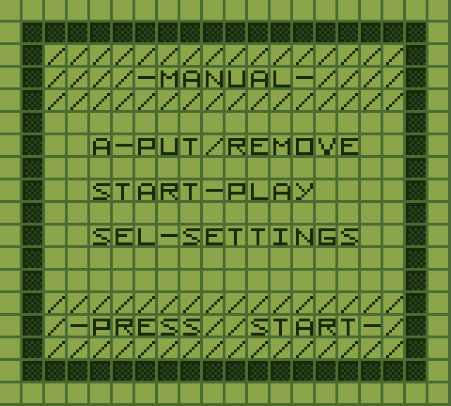
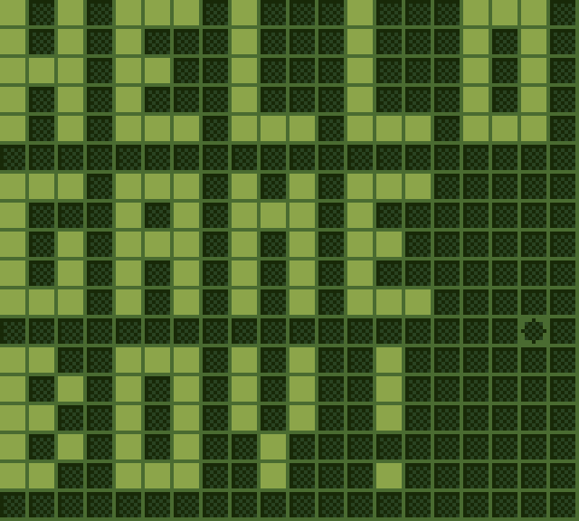

# About

**Game of Life GB** is a port of [Conway's Game of Life](https://conwaylife.com/) for the Nintendo Game Boy using [GBDK](https://github.com/gbdk-2020/gbdk-2020) and the [hUGEDriver](https://github.com/SuperDisk/hUGEDriver) for the music.

This game gives a 20x18 recursive cell grid with the ability to pause/unpause, edit, clear grid and randomize grid.


  
  
  
  
  


## Itch.io

<iframe frameborder="0" src="https://itch.io/embed/3245115?border_width=5&amp;bg_color=284020&amp;fg_color=88a048&amp;link_color=445434&amp;border_color=486830" width="560" height="175"><a href="https://killarexe.itch.io/game-of-life-gb">Game of Life GB by Killar.exe</a></iframe>

## Controls

A - Put / Remove cell from grid

B - Clear the grid

Start - Pause/Unpause the simulation

Select - Randomize the grid

Directional Pad - Moves the cursor on the grid when paused

## Repo


